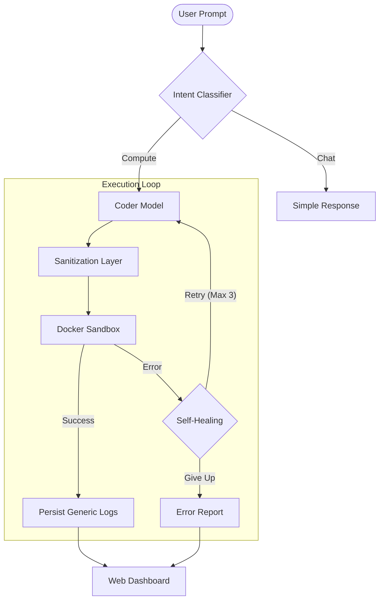

# 🤖 Agentic AI Orchestrator & Agentic-Execution-Engine


-6DB33F?style=for-the-badge&logo=spring&logoColor=white)


> **Autonomous AI Code Execution Platform**
> *Understand intent. Generate code. Execute securely. Self-heal.*

---

## 📖 Overview

This project is a **Technical Proof of Concept (PoC)** for an Agentic AI Orchestrator. It is designed to safely run LLM-generated code in a production-grade architecture.

**Key Capabilities:**
*   **Intent Understanding**: Distinguishes between conversational requests and actionable computing tasks.
*   **Code Synthesis**: Generates specialized Python code for complex problems.
*   **Secure Execution**: Runs untrusted code inside isolated, ephemeral Docker sandboxes.
*   **Self-Healing**: Automatically detects execution failures, feeds errors back to the AI, and retries up to 3 times.

---

## 🚀 Core Capabilities

### 🧠 Multi-Model Orchestration

The system employs a two-tier AI architecture to balance speed and intelligence:

| Role | Model | Responsibility |
| :--- | :--- | :--- |
| **Router** | `Llama 3.2` | Fast intent detection & task routing. |
| **Coder** | `llama3.1:8b` | Deep reasoning & Python code synthesis. |

### 🐳 Secure Docker Sandboxing

All AI-generated code runs in ephemeral Docker containers with strict resource limits to ensure safety:

*   **Memory**: 512 MB hard limit
*   **CPU**: 50% quota
*   **Network**: DISABLED (No external access)
*   **Lifecycle**: Auto-removed immediately after execution

### 🔄 Autonomous Self-Healing

The agent doesn't just fail; it learns.
1.  **Execute**: Container runs the code.
2.  **Catch**: System captures traceback on failure.
3.  **Reflect**: Error is sent back to the `Coder` model.
4.  **Retry**: Corrected code is generated and re-run.

---

## 🛠️ Technology Stack

| Category | Technologies |
| :--- | :--- |
| **Backend** | Java 25, Spring Boot 4 (Snapshot), JPA, H2 Database, Virtual Threads |
| **AI** | LangChain4j, Ollama (Llama 3.2, llama3.1:8b) |
| **Infrastructure** | Docker Engine API for Java |
| **Frontend** | HTML5, Tailwind CSS, Vanilla JavaScript |

---

## 📐 System Architecture

The system follows a fully agentic execution pipeline:



---

## 🔧 Setup & Installation

### Prerequisites
*   **Docker Engine** running locally (expose daemon if on Windows/WSL).
*   **JDK 25** installed.
*   **Ollama** running with the required models:
    ```bash
    ollama pull llama3.2
    ollama pull llama3.1:8b
    ```

### Installation

1.  **Clone the repository:**
    ```bash
    git clone https://github.com/your-username/orchestrator.git
    cd orchestrator
    ```

2.  **Configuration:**
    Check `src/main/resources/application.yml` and ensure your Ollama base URL is correct (default: `http://localhost:11434`).

3.  **Run the application:**
    ```bash
    mvn spring-boot:run
    ```

4.  **Access the Dashboard:**
    Open [http://localhost:8080](http://localhost:8080) in your browser.

---

## 🛡️ Security Architecture

| Feature | Implementation | Purpose |
| :--- | :--- | :--- |
| **Network Isolation** | `withNetworkDisabled(true)` | Prevents data exfiltration and external attacks. |
| **RAM Limit** | `512 MB` | Prevents memory exhaustion DoS. |
| **CPU Limit** | `50%` | Ensures host system stability. |
| **Ephemeral State** | `Auto-remove` | No filesystem state survives execution. |

---

## 🎯 Why This Matters

This project demonstrates that **Autonomous AI Agents** can be more than just chatbots. By combining **LLM reasoning** with **secure sandboxing**, we can create systems that not only talk but *do*—safely and reliably.
